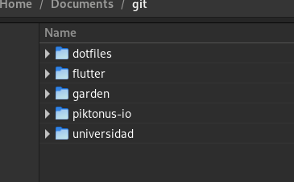

## Brave Extension

- activity watcher !!!!!!!!!!!!!!!!!!!!!!!

- Descargar e instalar Fira Code de los nerds fonts

# TODO

- Verificar que las notas de logseq esten seguras,
- Hacer un backup de los archivos. 
- Hacer el lab de RHCSA nuevamente?
- Instalar Stremio
- Instalar Microsoft teams
- Hacer u backup de los archivos

- Extensiones
    - Blur my shell
    - Espresso
    - Just Perfection
    - Material Shell? 
    - Sound and Input Chooser
    - User Themes

https://www.electronjs.org/apps/lepton
https://read.amazon.com/reader?asin=B08QXP4Q2J&ref_=kwl_kr_iv_rec_1&language=en-US
https://www.youtube.com/results?search_query=terraform+real+time+projects+
https://exercism.org/dashboard
https://github.com/AcalephStorage/awesome-devops
https://codingbee.net/rhcsa/rhcsa-accessing-built-in-help-guides
https://www.last.fm/music/Show+Me+a+Dinosaur/Show+Me+A+Dinosaur
https://www.kevinslin.com/notes/3dd58f62-fee5-4f93-b9f1-b0f0f59a9b64/
https://arc.dev/resume/builder/edit
https://vvvxsoftware.bandcamp.com/album/-
https://www.youtube.com/watch?v=qcr2kVbEaqI
https://www.youtube.com/watch?v=azcrPFhaY9k

